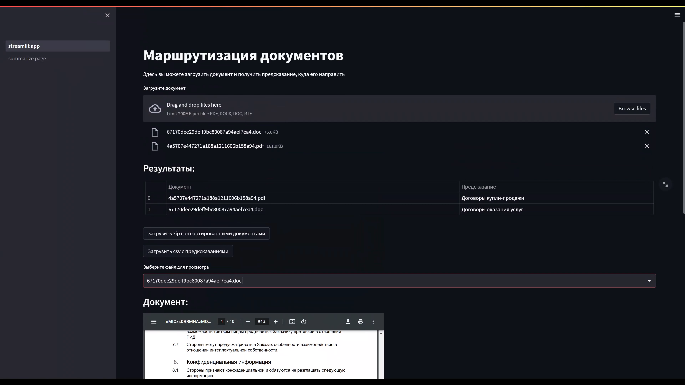
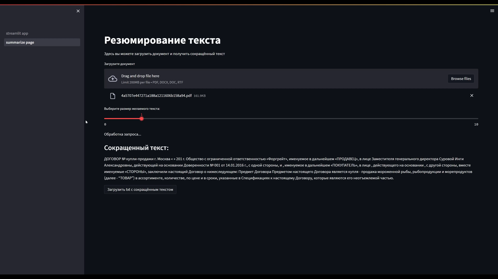
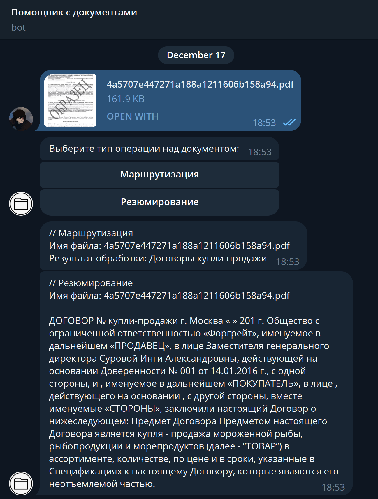

# XMAS HACK

## Competition overview

Task is to create web-service to sort documents by type of contract. \
Also we need to interpret the contract and extract some information from it.

## Methods

I have created web-service with streamlit. \
But also I have created simple telegram bot.

I used 2 methods to solve this task:

1. Classification using ruBert (accuracy 0.99 on test data)
2. Summarization using spacy

You could find unrealized methods in some notebooks in the `notebooks` folder.

## How it looks like

### Web-service

| Routing | Summarization |
| :-----: | :-----------: |
|||

### Telegram bot



## Run code

### Main setup

```bash
pip install -r requirements.txt
```

### Telegram Bot

You should create .env in root folder and add your bot token to it.

```.env
API_TOKEN=<YOUR_TOKEN>
```

and then run

```bash
python telegram_app.py
```

### Streamlit App

```bash
streamlit run streamlit_app.py
```
